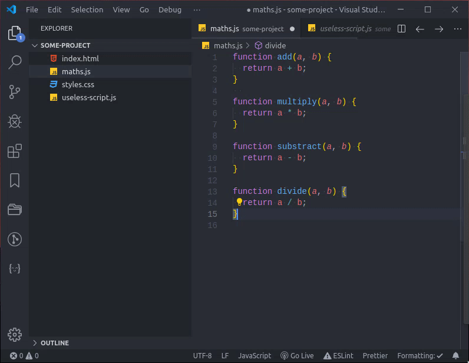

# Back & Forth README

This small extension for VSCode adds go back/forward buttons to the title bar for easier navigation through recent files. Just like arrows in any web browser.

They do the same as these default shortcuts:

| Command      | Keybindings (Windows/Linux) | Keybindings (Mac) |
| ------------ | --------------------------- | ----------------- |
| `Go back`    | `Ctrl + Alt + -`            | `⌃-`              |
| `Go forward` | `Ctrl + Shift + -`          | `⌃⇧-`             |

## How it works

## Settings

| Name                     | Description                         |
| ------------------------ | ----------------------------------- |
| `back-n-forth.iconStyle` | Can be either `arrow` and `chevron` |

## Release Notes

### 0.2.0

- Add ability to change icon style

### 0.1.1

- Changed description and changelog
- Added screenshot

### 0.1.0

- Initial release 🎉

**Enjoy!**
